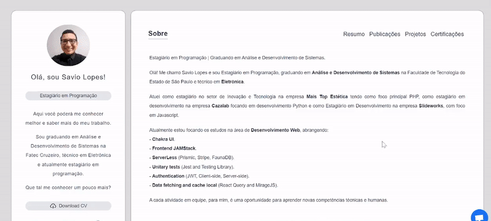

# Personal Portfolio - Savio Lopes


<br>

<p align="center">
  
</p>

<br>

## Tópicos

[Sobre o Projeto](#sobre-o-projeto)

[Tecnologias](#tecnologias)

[Autor](#autor)

[Agradecimentos](#agradecimentos)

<br>

## Sobre o Projeto

Portfólio Pessoal desenvolvido utilizando Next JS, Framer Motion e TypeScript

<br>

### Aplicação Web

<p align="center">
  
</p>

<br>

## Tecnologias da Aplicação Web

Tecnologias e ferramentas utilizadas no desenvolvimento da Web:

- [React](https://reactjs.org/)
- [TypeScript](https://www.typescriptlang.org/)
- [TailWindCSS]()
- [React-router-dom]()

<br>

## O projeto está implantado no Netlify:

[Deploy](https://savioaugustolopes.netlify.app/)

<br>

## Instalação

```bash
$ yarn
$ yarn dev
```

<br>

## Autor

[](https://github.com/savio-2-lopes)
[](https://www.instagram.com/savioaugulopes/)
[](https://www.linkedin.com/in/savio-lopes/)
[](mailto:savio.dev.lopes@gmail.com)

Feito com ❤️ por [Savio Lopes](https://www.linkedin.com/in/savio-lopes/)

---


## 💙 Agradecimentos

Meus agradecimentos ao projeto open-soruce [Dev Portolio, por Dey-Sumit](https://github.com/Dey-Sumit/Dev-Portfolio-Next-X) por disponibilizar esse conteúdo sensacional.
